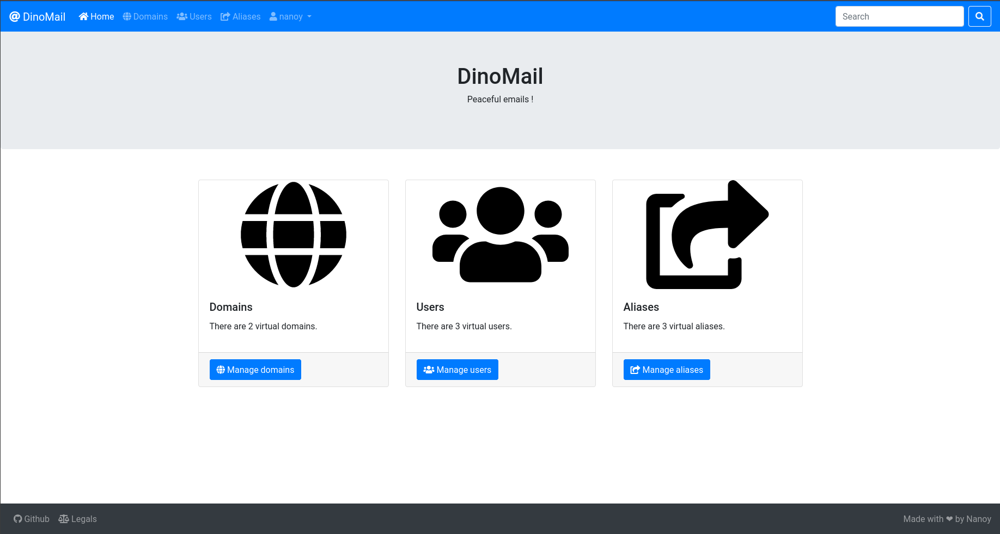

Installation
============

Database
########

You will need a working database for this project. We recommend the use of PostgreSQL but any database working with django (see `here <https://docs.djangoproject.com/en/3.0/ref/databases/>`_) will do the trick.

However, please note that this software should be linked to mail server softwares like postfix and dovecot and that any datbase might not work with those. Please see the documentations of those before choosing any database.

You will need to create, before installatiom, a database (e.g. ``dinomail``) and a user (e.g. ``dinomail``) with some password that we will denote ``secret`` for the rest of this page.

Clone and install dependencies
##############################

First you will have to clone the Github repository of the project. We recommmend you to clone from the last release.

.. code-block:: bash

    git clone https://github.com/nanoy42/dinomail

Then you need to install the dependencies. There is a Pipfile, from which you can just do 

.. code-block:: bash

    pipenv install

Or you can use the requirements.txt file :

.. code-block:: bash

    pip3 install -r requirements.txt

Settings
########

In the ``src/dinomail`` folder there is file ``local_settings.example.py``. Copy it in the same directory as ``local_settings.py`` :

.. code-block:: bash

    cp src/dinomail/local_settings.example.py src/dinomail/local_settings.example.py

Next, you will have to edit this file to change the settings. Some are django settings, some are api settings and some are DinoMail specific settings. There ar described below.

Django settings
***************

Please see the `django documentation <https://docs.djangoproject.com/fr/3.0/ref/settings>`_ for extended documentation.

.. attribute:: SECRET_KEY

A secret key for a particular Django installation. This is used to provide cryptographic signing, and should be set to a unique, unpredictable value. This value should be kept secret.

.. attribute:: DEBUG

A boolean that turns on/off debug mode. You should use ``DEBUG=False`` for production.

.. attribute:: ALLOWED_HOSTS

A list of strings representing the host/domain names that this Django site can serve.

.. attribute:: DATABASES

If you use a postgresql database, on the same host as where you installed DinoMail, with the above values, it should look like this:

.. code-block:: python

    DATABASES = {
        "default": {
            "ENGINE": "django.db.backends.postgresql",
            "NAME": "dinomail",
            "USER": "dinomail",
            "PASSWORD": "secret",
            "HOST": "localhost",
        }
    }

    
.. attribute:: LANGUAGE_CODE

User will not be able to change the interface language. However, you can select the language you want from the listed below : 

 * English (``'en'``)
 * French (``'fr'``)

Those are the languages currently supported for DinoMail.

.. attribute:: STATIC_ROOT

Folder in which the static files should be copied.

API settings
************

Tastypie is used for the API. One setting is set in the ``local_settings.example.py`` :

.. attribute:: API_LIMIT_PER_PAGE

Default number of object to display when an api request is made. 0 stands for no limit. Default (in DinoMail) is 0.

.. note:: If the value is not set, the default value from tastypie is 20.

There are some other settings from tastypie, you can see them `here <https://django-tastypie.readthedocs.io/en/latest/settings.html>`_.

DinoMail settings
*****************

There are three DinoMail specific settings:

.. attribute:: DINOMAIL_NAME

The name that will appear in the navbar, in the tab, on the login page and on some other places on the interface. Default is ``DinoMail``.

.. attribute:: DINOMAIL_CATCH_LINE

Sentence displayed on the home page.

.. attribute:: DINOMAIL_LEGALS

Paragraph displayed on the legals page.

.. attribute:: DINOMAIL_PASSWORD_SCHEME

Dovecot supports various password schemes. DinoMail supports most of them. By default the salted-sha512 is used.

.. note:: By default, dovecot use the bcrypt scheme, but this scheme requires an extra python library.

Here are the supported schemes:

 * PLAIN (``core.utils.make_password_plain``)
 * PLAIN-TRUNC (``core.utils.make_password_plain_trunc``)
 * CLEARTEXT (``core.utils.make_password_cleartext``)
 * CLEAR (``core.utils.make_password_clear``)
 * SHA (``core,utils.make_password_sha``)
 * SSHA (``core.utils.make_password_ssha``)
 * SHA256 (``core.utils.make_password_sha256``)
 * SSHA256 (``core.utils.make_password_ssha256``)
 * SHA512 (``core.utils.make_password_sha512``)
 * SSHA512 (``core.utils.make_password_ssha512``)
 * PLAIN-MD5 (``core.utils.make_password_plain_md5``)
 * LDAP-MD5 (``core.utils.make_password_ldap_md5``)
 * CRYPT (``core.utils.make_password_crypt``)
 * DES-CRYPT (``core.utils.make_password_des_crypt``)
 * MD5-CRYPT (``core.utils.make_password_md5_crypt``)
 * SHA256-CRYPT (``core.utils.make_password_sha256_crypt``)
 * SHA512-CRYPT (``core.utils.make_password_sha512_crypt``)

This schemes are also supported, installing an extra library:

 * ARGON2I (``core.utils_argon.make_password_argon2i``) and ARGON2ID (``core.utils_argon.make_password_argon2id``) installing ``argon2-cffi``.
 * BLF-CRYPT (``core.utils_bcrypt.make_password_blf_crypt``) installing ``bcrypt``.
 * LANMAN (``core,utils_passlib.make_password_lanman``) installing ``passlib``.

.. warning:: Some of these schemes are considered *unsecure*. Even if there are supported, please don't use them. Use salted hashing algorithms.

The following algorithms are supported by Dovecot but not by DinoMail:

 * HMAC-MD5
 * OTP
 * RPA
 * SKEY
 * PLAIN-MD4
 * SCRAM-SHA-1
 * NTLM
 * MD5
 * PBKDF2
 * CRAM-MD5
 * SMD5
 * DIGEST-MD5
 
Run migration, create a superuser and run the app
#################################################

To run migrations (i.e. create the database schema), you need to run the following command after setting the database :

.. code-block:: bash

    python3 manage.py migrate

You can then create a superuser with the command

.. code-block:: bash

    python3 manage.py createsuperuser

You will be prompted for some information.

You can check the intstallation by running : 

.. code-block:: bash

    python3 manage.py check

Then you can test the app with

.. code-block:: bash

    python3 manage.py runserver 0.0.0.0:8000

.. warning:: You should not use runserver for production. Instead, use wsgi modules for apache or nginx by instance.

Statics
#######

The good option is to serve the statics directly with your web server. Then if ``DEBUG`` is set to False, DinoMail will not serve the statics.

You have to set the ``STATIC_ROOT`` settings and execute the 

.. code-block:: bash

    python3 manage.py collectstatic

and configure your web server. For example, for apache, you could add the following line : 

.. code-block:: apache

    Alias /static/ /var/www/dinomail/static

if you have set ``STATIC_ROOT`` to ``/var/www/dinomail/static`` for example.

Translation
###########

To compile translation files, use the following command : 

.. code-block:: bash

    django-admin compilemessages