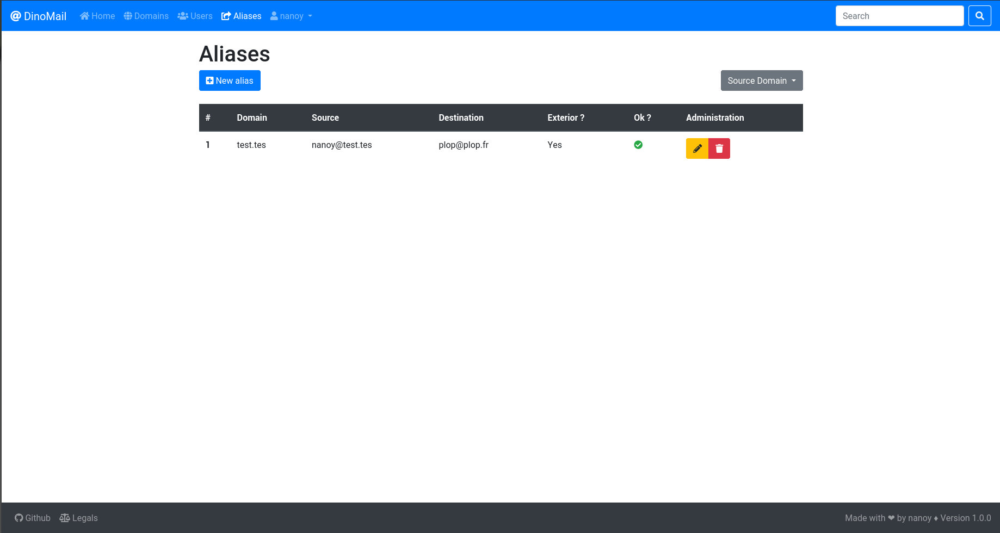

Quickstart
==========

Introduction
############

This page quickly explains the functionnalities of DinoMail.

Almost any operation can be made using the admin site of django, in fact all except 2 which are the modification of a user's password and the regeneration of an api key.

You can access the admin and regenerate your apikey by clicking on your username in the navbar and choosing the appropriate option.

Virtual Domains
###############

Introduction
************

Virtual domains are domains for which your mail server is responsible for.

Manage virtual domains
**********************

You can create, change and delete virtual domains on the virtual domains page :

On each row :

 * The first button (the cog) downloads the xml autoconfig file.
 * The second button (the signature) gives two choices : update the DKIM status or see the DKIM scan details.
 * The third button (the pencil) displays a form to change the domain.
 * The last button (the bin) deletes the domain (you will be asked to confirm deletion).

Fields
******

.. attribute:: VirtualDomain.name

**Required**

Name of the domain, in the form ``example.org``.

This attribute should be unique.

.. attribute:: VirtualDomain.dkim_key_name

Dkim key name (the one in the DNS record name).

.. attribute:: VirtualDomain.dkim_key

Value of the dkim public key (the one stored in the DNS TXT record).

.. attribute:: VirtualDomain.display_name

Display name for the xml autoconfig file.

.. attribute:: VirtualDomain.short_display_name

Short display name for the xml autoconfig file.

.. attribute:: VirtualDomain.imap_address

The imap address for the xml autoconfig file. If not set, ``imap.(name of domain)`` will be used.

.. attribute:: VirtualDomain.pop_address

The pop address for the xml autoconfig file. If not set, the pop section will be skipped.

.. attribute:: VirtualDomain.smtp_address

The smtp address for the xml autoconfig file. If not set, ``smtp.(name of domain)`` will be used.

Virtual Users
#############

Manage virtual users
********************

You can create, change. change password and delete virtual users which are actual mailboxes.

On each row :

 * The first button (the lock) displays a form to change user's password.
 * The second button (the pencil) displays a form to change the user.
 * The last button (the bin) deletes the user (you will be asked to confirm deletion).

.. warning:: When creaing or modifying a user, the quota should be given in **bytes**.

Fields
******

.. attribute:: VirtualUser.domain

**Required**

The VirtualDomain of the account.

.. attribute:: VirtualUser.email

**Required**

The email of the account. 

This attribute should be unique.

.. attribute:: VirtualUser.password

**Required**

The hashed password of the account (in a dovecot-compliant way).

.. attribute:: VirtualUser.quota

**Required**

The quota of the account, in **bytes**.

Virtual Aliases
###############

You can create, change and delete virtual aliases which are fake email account that redirects to true ones.

On each row :

 * Exterior means if the domain of the **destination** email is handled by the current instance or not.
 * Ok ? verifies, in the case of an interior email, if the **destination** email exists as an alias or a virtual user in the database.
 * The first button (the lock) displays a form to change user's password.
 * The second button (the pencil) displays a form to change the user.
 * The last button (the bin) deletes the user (you will be asked to confirm deletion).